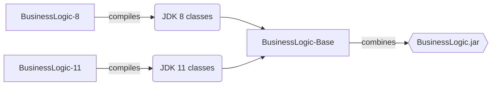

## The BusinessLogic Parent project

This project is merely a POM project that combines the classes from the JDK specific projects in [BusinessLogic](../).

The pom takes the compiled classes from each project, and creates a [Multi-Release JAR](https://openjdk.org/jeps/238). This will create the artifact "BusinessLogic-X.Y.jar" which contains classes for each supported JDK. If running on JDK 8, only classes created in [BusinessLogic-8](../BusinessLogic-8) will be executed, and if running on JDK 11, or above, the same way for [BusinessLogic-11](../BusinessLogic-11).

