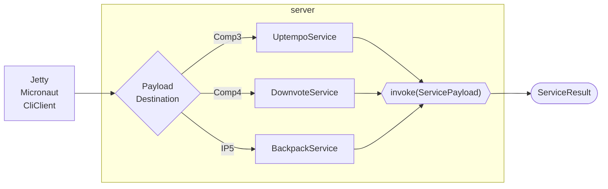

## The BusinessLogic



## Adding new BusinessLogic Service
For a new Business Logic service you need three classes. Imagine the example service "EnergyService"
* EnergyService extends BusinessLogicService
* EnergyPayload extends Payload
* EnergyResult extends Result

The service class must:
1. implement the `invoke` method that does the actual job
2. have a public constructor that takes the payload and result class, and calls the super calss constructor

```java
public class EnergyService extends BusinessLogicService<EnergyPayload, EnergyResult>
  public EnergyService(Class<EnergyPayload> payloadClass, Class<EnergyResult> resultClass) {
    super(payloadClass, resultClass);
  }
  public EnergyResult invoke(EnergyPayload payload) throws BusinessLogicException {
    ..
  }
}
```

In order for the service class to be called, it has to be mapped to a payload Destination in the [BusinessLogicFactory](https://github.com/jaokim/inside-java-dumpster/blob/main/BusinessLogic/src/main/java/inside/dumpster/bl/BusinessLogicFactory.java) class
```java
  switch(destination) {
    ..
    case "Comp5":
      service = new EnergyService(EnergyPayload.class, EnergyResult.class);
      break;
    ..
  }
```

If the service should consumes any data (apart from the standard payload data), it also has to be added to the Client [PayloadDataGenerator](https://github.com/jaokim/inside-java-dumpster/blob/main/Client/src/main/java/inside/dumpster/client/impl/PayloadDataGenerator.java) class. (This is subject to change.)

## Adding bugs to the service

Please see [OutsideDumpster](https://github.com/jaokim/inside-java-dumpster/tree/main/OutsideDumpster) for details on how to add bugs to your code.
