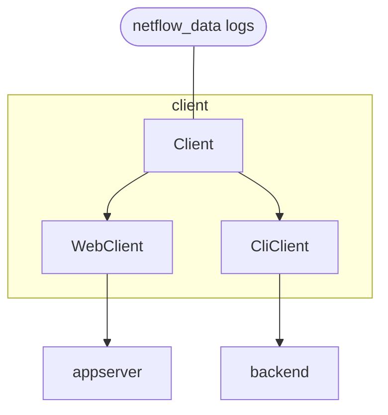

The client side of the dumpster takes data from the [Unified Host and Network Data Set](https://csr.lanl.gov/data/2017/), parses this and creates a Payload. 
* The payload has a Destination which is based on the Src Device. 
* The destination decides which service in the BusinessLogic layer should handle the payload.
* Besides all columns from a logline, the payload can have a body of data attached to it. The kind of data is decided based on the destination; this can be text data, image data, or something else.


```
|Timestamp|Duration|Src Device|Dst Device|Protocol|Src Port|Dest Port|Src packets|Dst Packets|Src Bytes|Dst Bytes|
|---|---|---|---|---|---|---|---|---|---|---|
|118781|5580|Comp364445|Comp547245|17|Port05507|Port46272|0|755065|0|1042329018|
|118783|6976|Comp450942|Comp829338|6|Port03137|445|1665|1108|300810|250408|
|118785|14178|IP564116|Comp141988|17|5060|5060|1866|0|1477041|0|
|118785|28147|IP564116|Comp141988|17|5060|5060|3326|0|2656305|0|
|118785|48507|IP564116|Comp141988|17|5060|5060|5423|0|4388449|0|
|118785|148289|IP564116|Comp141988|17|5060|5060|16366|0|13365368|0|
|118785|167723|IP564116|Comp141988|17|5060|5060|18213|0|14897583|0|
|118785|179543|IP564116|Comp141988|17|5060|5060|19467|0|15924693|0|
|118785|223056|IP564116|Comp141988|17|5060|5060|24344|0|19914020|0|
|118785|238229|IP564116|Comp141988|17|5060|5060|25816|0|21135448|0|
|118785|253649|IP564116|Comp141988|17|5060|5060|27333|0|22393722|0|
|118785|262319|IP564116|Comp141988|17|5060|5060|28257|0|23149303|0|
|118841|5071|Comp364445|Comp870517|17|Port55006|Port46272|0|387956|0|528637071|
|118843|15340|Comp364445|Comp870517|17|Port68697|Port28366|2702|3219|226968|296148|
|118843|28287|Comp364445|Comp870517|17|Port68697|Port28366|5445|6438|457380|592296|
```





