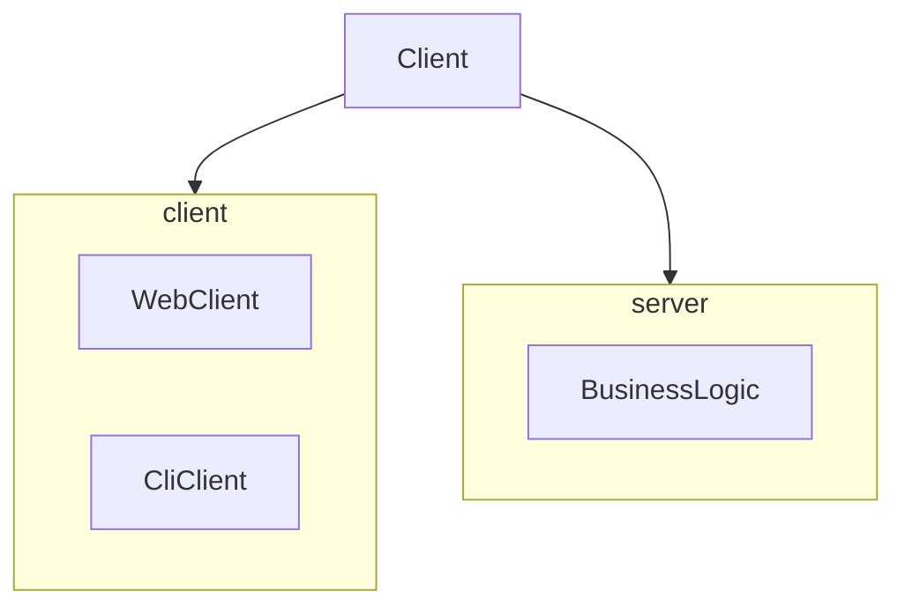

The Client module 
* defines and creates the Payload consumed by the BusinessLogic services
* defines the interface for the Result returned by the BusinessLogic
* has a set of helper classes to aid in data creation, and consumption for both clients and servers

## Input data
The input data comes from the [Unified Host and Network Data Set](https://csr.lanl.gov/data/2017/). 

|Timestamp|Duration|Src Device|Dst Device|Protocol|Src Port|Dest Port|Src packets|Dst Packets|Src Bytes|Dst Bytes|
|---|---|---|---|---|---|---|---|---|---|---|
|118781|5580|Comp364445|Comp547245|17|Port05507|Port46272|0|755065|0|1042329018|
|118783|6976|Comp450942|Comp829338|6|Port03137|445|1665|1108|300810|250408|
|118785|14178|IP564116|Comp141988|17|5060|5060|1866|0|1477041|0|
|118785|28147|IP564116|Comp141988|17|5060|5060|3326|0|2656305|0|
|118785|262319|IP564116|Comp141988|17|5060|5060|28257|0|23149303|0|
|118843|28287|Comp364445|Comp870517|17|Port68697|Port28366|5445|6438|457380|592296|

The Client parses this and creates a [Payload](src/main/java/inside/dumpster/client/Payload.java) for each row
* The payload has a [Destination](https://github.com/jaokim/inside-java-dumpster/blob/main/Client/src/main/java/inside/dumpster/client/Payload.java#L37) which is based on the Src Device. 
* The Destination decides which service in the BusinessLogic layer should handle the payload.
* Besides all columns from a logline, the payload can have a body of data attached to it. The kind of data is decided based on the destination; this can be text data, image data, or something else. See [PaylodDataGenerator](src/main/java/inside/dumpster/client/impl/PayloadDataGenerator.java).

## Client implementations

There are currently two clients available:
* [WebClient](../WebClient) creates a HttpPayload to send to arbitrary HTTP endpoint
* [CliClient](../CliClient) calls the BusinessLogic server directly, without any network involvment

The WebClient is designed to be used on one machine/JVM, with the BusinessLogic server running on another.
The CliClient is only using one JVM to simulate the entire server environment.

