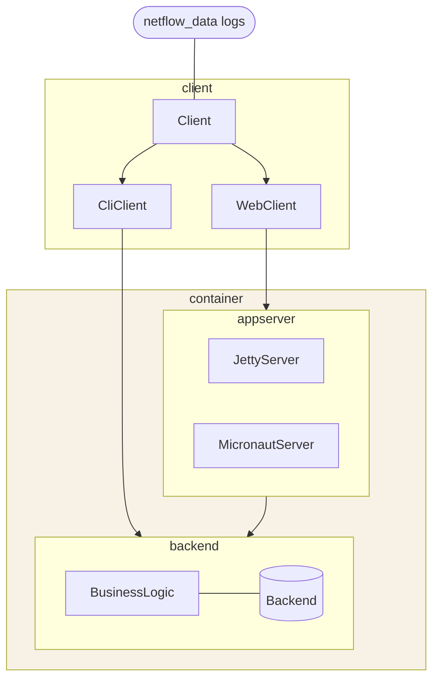

Accompanying code for my blog [jaokim.github.io](https://jaokim.github.io/).

## Introduction
The code here tries to mimic a relatively likely production system. The mimiced system is supposed contain a plethora of bugs, anti-patterns, memory hogs, oddities, performance issues and in general be less than ideal. It serves as a sandbox, or playground to demonstrate how to troubleshoot various issues.

Disclaimer: This code contains both subtle and not so subtle bugs -- that is its purpose.

Some motivations behind the project:
* reproducible executions; requests to the application are created from actual log files
* create life-like JFR event examples, to not only create "TestEvent" and the likes
* has different web application servers (Micronaut, Jetty, will add WLS) in order to test where f.i. JFR VM properties are set

### Overview

If you're looking for code for my [old blog posts at inside.java](https://inside.java/u/JoakimNordstrom/), go look in the [tag inside.java](https://github.com/jaokim/inside-java-dumpster/tree/inside.java)

