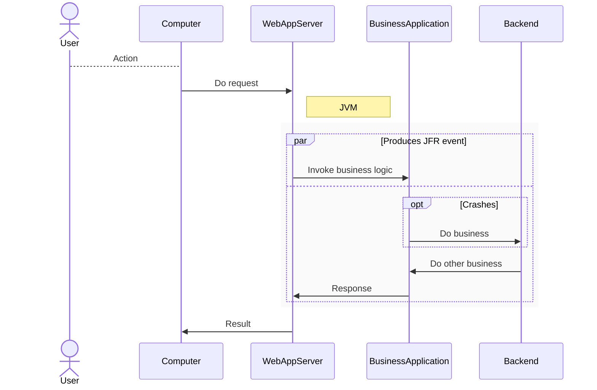

# Introduction
The code here tries to mimic a relatively likely production system. The mimiced system is supposed contain a plethora of bugs, anti-patterns, memory hogs, oddities, performance issues and in general be less than ideal. It serves as a sandbox, or playground to demonstrate how to troubleshoot various issues.

> This project implements a fake business application, that gets request, and produces results.



:heavy_exclamation_mark: Disclaimer: This code contains both subtle and not so subtle bugs -- that is its purpose.

## Motivations and objective
* produce JFR events, to learn JMC and try out stuff
* life-like env. to set JFR properties and arguments to get away from simple examples like:
     `java -XX:StartFlightRecording Example.java`
* reproducible executions; requests to the application are created from actual log files
* recreate bugs or weird behaviour
* has different web application servers (Micronaut, Jetty, will add WLS) in order to test where f.i. JFR VM properties are set

## Possible scenarios
:bomb: crash "randomly" for learning purposes -- not just `java Crash.java` 

:watch: find memory leaks, bottlenecks, etc

:bar_chart: create life-like JFR event examples, to not only create "TestEvent" and the likes

:chart_with_upwards_trend: using JConsole to remote JVM via ssh tunneling

:vhs: JFR remote recording stream to containerized servers

:coffee: create multi-JDK environments (JDK8 combined with JDK17)

---
## Hands-on-lab suggestion
> The aim of this hands-on-lab is to expose the attendee to the monitoring and troubleshooting tools available in any vanilla JDK. A real-world-like sandbox business application is used to allow exploration in a safe environment with examples resembling real issues encountered in Java applications. After completing this lab you'll be able to:
>
> * Remotely monitor and control a live Java application
> * Configure Java Flight Recorder for different tasks
> * Diagnose applications using JDK Flight Recorder and JDK Mission Control
> * Examine HotSpot crashlogs

---

# Overview


# An example test-run
Preferable you'd want a remote machine to run the server JVM on, but it works with an all local setup.
* You need atleast JDK17.

Check out all the code and build using Maven (I might supply pre-built binairies at some point).
Start two terminals (has been tested on cygwin). 

In terminal 1, start the Micronaut Webserver
```
sh ./runmicronaut.sh
```

In terminal 2, start JConsole and connnect to the Micronaut JVM
```
jconsole &
```
Then, start the webclient script to create network requests.
```
sh runwebclient.sh
```

The runwebclient script first starts a delayed JFR recording for 60 seconds, and then produces network request for atleaset 60 seconds.
When done, the webclient should stop, and you should have a JFR recording to analyze (or a crashlog!).

### Excercise 1
Find out which service is the slowest, and why. When you've found the likely culprit, set it as non-buggy in JConsole, and do another test run.


---
If you're looking for code for my [old blog posts at inside.java](https://inside.java/u/JoakimNordstrom/), go look in the [tag inside.java](https://github.com/jaokim/inside-java-dumpster/tree/inside.java)


